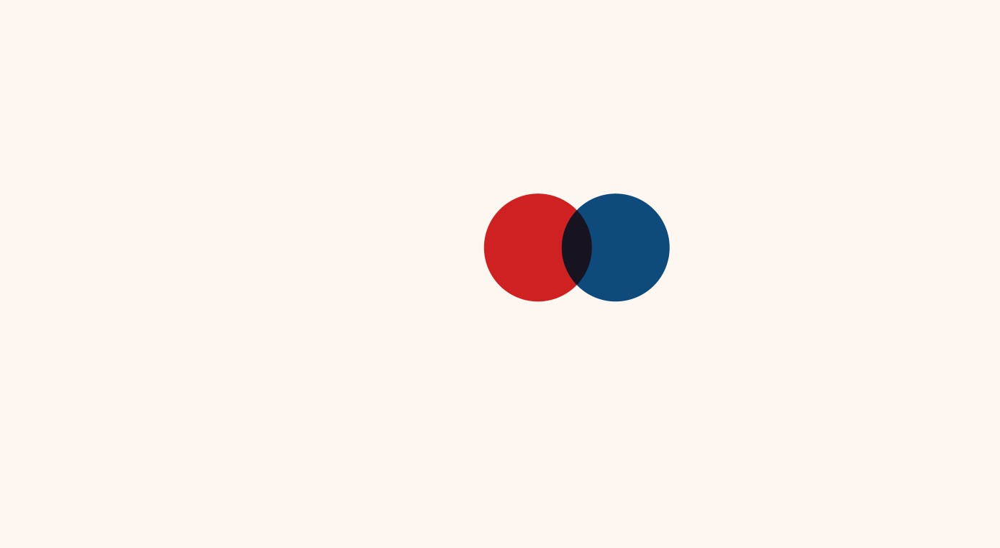

# slice-the-color

Simple and fun interactive to learn colors!\
Try to slice the circle and it will be sliced into two circles with the colors that make up the previous color

_Note: color formula indicated with the current version of the app may not be correct and only used for testing purpose_

## Screenshots

## Future Improvements

-   Smarter way to detect if you drag through a particular circle
-   Add interface for choosing the color to begin with
